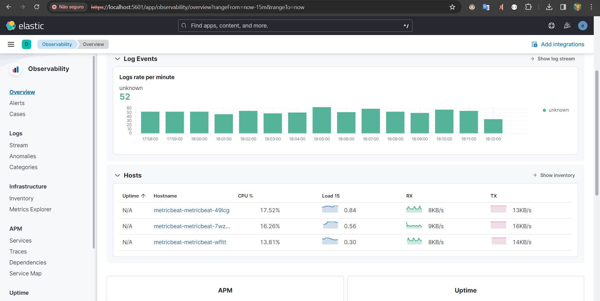

# ELK Stack on K8S cluster with SSL on

## Versions
- Helm: 3.11
- ELK Stack: 8.5.1
- Kubernetes version: 1.26.6
- Docker (for certs creation)

## Step by step
0. Create a namespace called monitoring
---
1. Run "make secrets" on /elasticsearch folder to create SSL certificates. Charts that need to connect directly to ElasticSearch (Filebeat, Metricbeat, Kibana) are already receiving these certificates as needed via values.
---
2. Deploy Elasticsearch with /elastval.yaml as values
```sh
helm install elasticsearch ./elasticsearch --values=./elastval.yaml --namespace monitoring
```
3. Deploy Logstash with /logval.yaml as values
```sh
helm install logstash ./logstash --values=./logval.yaml --namespace monitoring
```
4. Run "make secrets" on /kibana folder to create internet-facing SSL certs
---
5. Deploy Kibana with /kibanaval.yaml as values
```sh
helm install kibana ./kibana --values=./kibanaval.yaml --namespace monitoring
```
6. Deploy MetricBeat with /metricval.yaml as values
```sh
helm install filebeat ./filebeat --values=./fileval.yaml --namespace monitoring
```
7. Deploy FileBeat with /fileval.yaml as values
```sh
helm install metricbeat ./metricbeat --values=./metricval.yaml --namespace monitoring
```
8. Test it locally
```
kubectl --namespace monitoring port-forward svc/kibana-kibana 5601:5601
```
9. Go to https://localhost:5601 , trust its certificate, then login with the default username "elastic" and the get your generated password:
```
kubectl --namespace monitoring get secrets elasticsearch-master-credentials -ojsonpath='{.data.password}' | base64 -d
```
Expected behavior:
